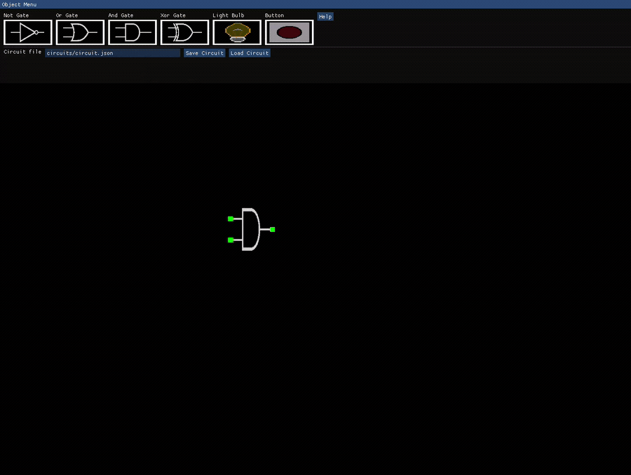
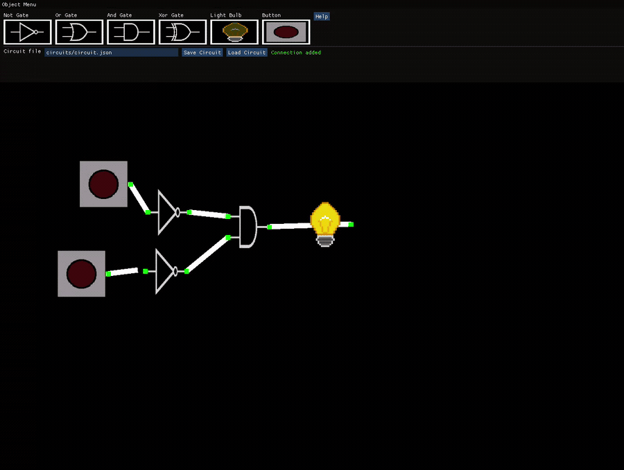
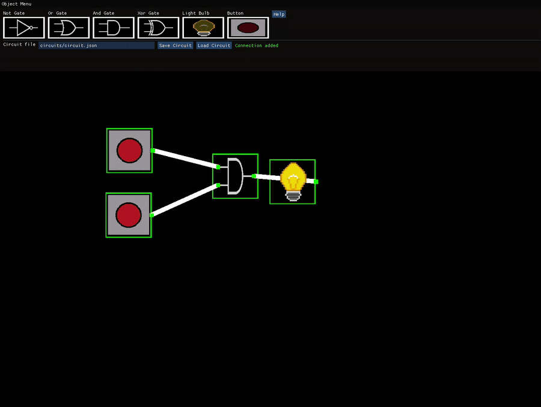
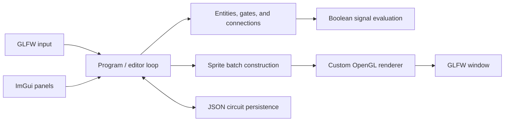

<div align="center">

# Dewy

### A visual digital-logic simulator with a renderer built from scratch

[](https://github.com/YousefMostafaFarouk/Dewy/actions/workflows/linux-build.yml)
[](https://github.com/YousefMostafaFarouk/Dewy/actions/workflows/windows-build.yml)


<br>

<table>
  <tr>
    <td width="33%"></td>
    <td width="33%"></td>
    <td width="33%"></td>
  </tr>
  <tr>
    <td><sub>Build, connect, and simulate live circuits</sub></td>
    <td><sub>Select, copy, paste, and delete circuit groups</sub></td>
    <td><sub>Save and reload circuits as JSON</sub></td>
  </tr>
</table>

<strong>Dewy is powered by an original custom OpenGL renderer designed and
built from scratch by me—not a game engine.</strong>

Build circuits by placing gates, wiring their ports, toggling inputs, and watching
signals propagate in real time. Dewy combines a custom batched OpenGL renderer
with an interactive ImGui editor and a small digital-logic simulation core.

</div>

## Highlights

- Interactive AND, OR, XOR, and NOT gates
- Toggleable input buttons and live output bulbs
- Visual output-to-input wiring
- Multi-selection, drag-to-move, copy, paste, and delete
- Cursor-centered zoom
- Human-readable JSON circuit save files
- Incremental cycle prevention and topological evaluation
- Linux, MinGW, and Visual C++ build paths
- Custom sprite batching, shaders, textures, and collision handling

## Custom renderer, built from scratch

Dewy does not use a game engine. Its rendering layer was designed and
implemented from scratch by me on top of OpenGL and GLFW. The
custom renderer owns shader compilation, texture loading and binding, vertex
buffers and layouts, vertex-array configuration, batched sprite submission,
projection updates, and the final draw calls. The renderer, original editor,
and simulation architecture all predate the later AI-assisted feature update.

## Quick start

### Linux

Install a compiler, CMake, OpenGL development files, and GLFW.

Arch Linux:

```bash
sudo pacman -S --needed base-devel cmake glfw mesa
```

Ubuntu or Debian:

```bash
sudo apt update
sudo apt install build-essential cmake libgl1-mesa-dev libglfw3-dev
```

Fedora:

```bash
sudo dnf install gcc-c++ cmake mesa-libGL-devel glfw-devel
```

Build and test with one command from the repository root:

```bash
./build.sh
```

Run it with:

```bash
./run.sh
```

The script performs the CMake configure, compilation, and tests for you. For a
debug build or custom CMake options, the equivalent manual commands are:

```bash
cmake -S . -B build -DCMAKE_BUILD_TYPE=Release
cmake --build build --parallel
ctest --test-dir build --output-on-failure
```

### Windows

#### Without Visual Studio

Use the free GCC/MinGW toolchain supplied by MSYS2:

1. Install [MSYS2](https://www.msys2.org/) in its default `C:\msys64` location.
2. Start MSYS2 once and allow its normal package update to complete.
3. Double-click `build-mingw.bat` in the Dewy repository.
4. Double-click `run-mingw.bat`.

The build script enters the recommended 64-bit UCRT environment, installs GCC,
CMake, Ninja, GLFW, and GLEW, compiles Dewy, runs the tests, and copies the
required runtime DLLs beside `Dewy.exe`. Visual Studio is not used or required.

#### With Visual Studio

The repository also contains the required Visual C++ GLFW, GLEW, GLM, ImGui,
and stb_image files.

1. Install Visual Studio 2022 with the **Desktop development with C++** workload.
2. Double-click `build.bat`, or run it from any terminal in the repository.
3. Double-click `run.bat` to start Dewy.

Alternatively, open `Dewy.sln`, select
`Release` and `x64`, then choose **Build > Build Solution** and run with
`Ctrl+F5`.

## Using the editor

1. Drag a component from **Object Menu** onto the canvas.
2. Click an output dot, then click an input dot to connect them.
3. Click an input button to toggle its Boolean state.
4. Drag gates to reposition them; connected wires follow automatically.
5. Drag an empty region to select several entities.

Keyboard shortcuts:

| Action | Shortcut |
| --- | --- |
| Copy selection | `Ctrl+C` |
| Paste at cursor | `Ctrl+V` |
| Delete selection | `Backspace` |
| Zoom | Mouse wheel |

### Saving and loading circuits

The pinned **Object Menu** toolbar contains a circuit path field plus
**Save Circuit** and **Load Circuit** buttons. Because it is part of the fixed
toolbar, the file controls cannot be moved away from the top of the editor. The
default location is `circuits/circuit.json`. Parent directories are created
automatically when saving.

To try a ready-made circuit, enter `../examples/xor-circuit.json` when running
from the build directory, then select **Load Circuit**.

You can also load a file while launching Dewy:

```bash
./run.sh ../examples/xor-circuit.json
```

This is the optional command-line interface (CLI) loading feature. The first
argument is treated as a JSON circuit path and is loaded before the editor
starts. It is useful for scripts and quick demos; the toolbar button is the
normal graphical workflow.

Circuit files are intentionally small and editable:

```json
{
  "version": 1,
  "entities": [
    {"id": 0, "type": "button", "x": -3, "y": 0, "state": true},
    {"id": 1, "type": "bulb", "x": 2, "y": 0, "state": false}
  ],
  "connections": [
    {"from_entity": 0, "from_component": 1, "to_entity": 1, "to_component": 0}
  ]
}
```

The loader parses and validates the entire document before replacing the active
canvas. It checks JSON syntax, required fields, schema version, supported entity
types, finite coordinates, unique entity IDs, referenced IDs, port indices,
output-to-input direction, cycles, and that a port is not connected more than once.
Errors are reported in the toolbar and the current circuit remains untouched.

Loading is a **replace** operation, not a merge. The imported circuit is built
in temporary memory first. Only after it succeeds is the old circuit cleared and
the imported one installed. Therefore, an imported entity with ID `0` does not
conflict with an existing on-screen entity with ID `0`; the two circuits never
coexist. IDs only need to be unique inside their own JSON file.

Saving to a path that already exists currently overwrites that file. Dewy does
not yet provide modification-time conflict detection, backups, or a confirmation
dialog.

## Architecture



The application keeps editing, simulation, persistence, and rendering concerns
separate enough to evolve independently:

- `Dewy/src/Program.cpp` owns the main loop and editor workflow.
- `Dewy/include/Entity.h` defines the simulation object interface.
- `LogicGate`, `Button`, and `LightBulb` implement component behavior.
- `ConnectionComponent` models typed input/output ports and wires.
- `CircuitSerializer` owns the versioned JSON format and validation.
- `TopologicalOrder` rejects cycles and schedules producer-before-consumer evaluation.
- `Renderer/` contains the OpenGL window, shader, texture, vertex-buffer, and
  sprite-batching code.

See [docs/DESIGN.md](docs/DESIGN.md) for the detailed design, data model,
rendering pipeline, persistence schema, and incremental graph ordering system.

## Automated build checks

The workflow in `.github/workflows/linux-build.yml` uses GitHub Actions to test
the project on a fresh Ubuntu virtual machine after every push and pull request.
It checks out the repository, installs the Linux dependencies, configures CMake,
builds Dewy, and runs the serializer tests. The **Linux Build** badge at the top
links to those runs. This is continuous integration (CI): it verifies changes,
but it does not publish a release or run the graphical editor. You can also
start it manually from **Actions > Linux build > Run workflow** on GitHub.

The Windows workflow compiles two independent configurations on fresh Windows
machines: the no-Visual-Studio MSYS2/MinGW build and the existing Visual C++
solution. The MinGW job also runs the serializer tests. This catches platform
and compiler-specific failures before a change reaches users.

## Repository layout

```text
Dewy/
├── CMakeLists.txt              Linux and cross-platform CMake build
├── build.sh / run.sh           One-command Linux build and launcher
├── build-mingw.*               Windows build without Visual Studio
├── build.bat / run.bat         Optional Visual C++ build and launcher
├── Dewy.sln                    Visual Studio solution
├── Dewy/
│   ├── include/                Editor and simulation headers
│   ├── src/                    Editor, simulation, and persistence code
│   ├── dependencies/ImGui/     Immediate-mode UI
│   └── resources/              Gate and UI textures
├── Renderer/
│   ├── code/include/           Renderer interfaces
│   ├── code/src/               OpenGL implementation
│   └── res/shaders/            GLSL shaders
├── docs/                       Design documentation and media
├── examples/                   Example JSON circuits
└── tests/                      Persistence and graph-ordering tests
```

## Project history and AI disclosure

Dewy's renderer, original editor/main-program code, and circuit simulation core
were designed and implemented by me without AI assistance,
before modern AI coding tools were capable of reliably producing work of this
scope. The project was later updated with AI assistance to add JSON circuit
saving and loading and the incremental topological-order system used for cycle
prevention. These additions build on top of my existing architecture
and renderer.
