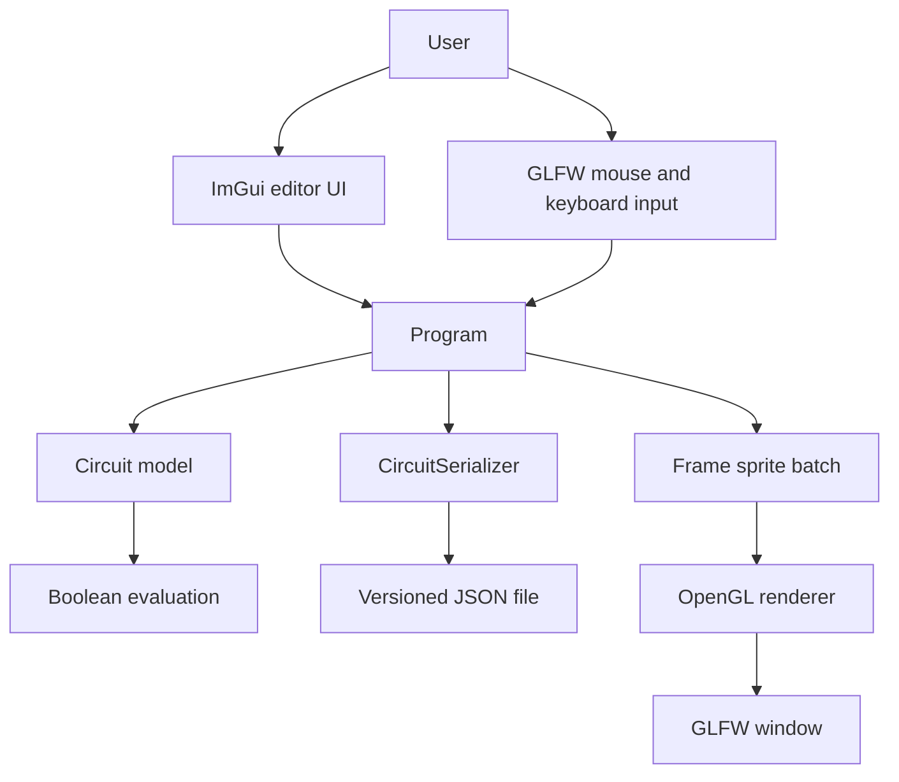

# Dewy design document

## 1. Purpose

Dewy is a desktop editor and real-time simulator for small combinational digital
circuits. Its goals are to make Boolean signal flow visually understandable and
to demonstrate the complete path from editor interaction to simulation and
custom GPU rendering.

The application deliberately owns its rendering abstractions instead of using a
game engine. GLFW creates the window and OpenGL context, ImGui provides editor
panels, and the `Renderer` project manages buffers, shaders, textures, and
batched sprite drawing.

## 2. Scope

### Current scope

- Primitive gates: AND, OR, XOR, and NOT
- Toggleable Boolean sources (`Button`)
- Boolean sinks (`LightBulb`)
- Output-to-input wiring
- Selection, movement, copy, paste, deletion, and zoom
- Versioned JSON save/load
- Windows and Linux builds

### Outside the current scope

- Sequential logic and time-based simulation
- Arbitrary output fan-out
- Hierarchical/sub-circuits
- Electrical properties such as voltage, delay, or tri-state signals
- Networked collaboration

## 3. System context



`Program` is currently the application coordinator. It translates input into
editor operations, owns all live entities, invokes simulation, assembles the
frame's sprite batch, and asks `Gui` and `SpriteRender` to draw.

## 4. Runtime loop

Each frame performs these phases:

1. Poll GLFW events and begin a new ImGui frame.
2. Draw and process the circuit-file panel.
3. Process component creation from the object menu.
4. Process entity dragging and port connections.
5. Process selection, copy, paste, and deletion.
6. Reset and evaluate entity states.
7. Build wire, selection, entity, and port sprites.
8. Upload the dynamic vertex batch and render it.
9. Render ImGui and swap the window buffers.

The order matters: editing completes before simulation, and simulation completes
before visual output is generated.

## 5. Circuit model

### Entity

`Entity` is the polymorphic base for every item placed on the canvas. It owns:

- A `Sprite` representing its visual body
- A Boolean `m_state`
- A list of `ConnectionComponent` ports
- Per-frame update state
- Movement, update, copy, and reset operations

The concrete entity types are:

| Type | Inputs | Outputs | Behavior |
| --- | ---: | ---: | --- |
| `Button` | 0 | 2* | User-controlled Boolean source |
| `LogicGate NOT` | 1 | 1 | Negates its input |
| `LogicGate AND` | 2 | 1 | True when both inputs are true |
| `LogicGate OR` | 2 | 1 | True when either input is true |
| `LogicGate XOR` | 2 | 1 | True when exactly one input is true |
| `LightBulb` | 1 | 0 | Displays the incoming state |

`*` One button output is currently an invisible click target retained by the
legacy interaction model; the visible output is component index 1.

### Connections

Each `ConnectionComponent` belongs to one entity and is marked as an input or
output. A wire is represented by symmetric pointers between the two connected
ports. Moving an entity moves its ports; the wire geometry is reconstructed from
the port centers every frame.

The current representation supports one connection per port. Supporting fan-out
will require either multiple target references on outputs or an explicit split
node in the model.

### Ownership

`Program` owns the live `Entity` pointers. Each entity owns its ports. Connection
pointers are non-owning graph edges. Loading constructs a complete temporary
entity set before the old set is deleted and replaced.

Circuit IDs belong to a serialized document; they are not permanent global IDs.
Loading replaces the live circuit instead of merging with it, so IDs in the old
and imported circuits cannot conflict. Duplicate IDs inside one document are
invalid and are rejected before the live circuit changes.

## 6. Simulation

Buttons return their stored state. Gates recursively request the states of the
entities connected to their input ports and cache the result for the current
frame. Bulbs choose their active or inactive texture from their input.

This recursive design works for directed acyclic circuits but is unsafe for a
cycle because an entity may be revisited before its update flag is set.

### Incremental ordering and cycle prevention

The circuit is treated as a directed graph where an edge points from the
entity owning an output port to the entity owning the connected input port.

The editor maintains one topological ordering plus an entity-to-position
map. For a proposed edge `source -> destination`:

1. Reject it if both endpoints belong to the same entity.
2. If `position[source] < position[destination]`, accept it in constant time.
   The edge already points forward, so it cannot create a cycle and the existing
   order remains valid.
3. Otherwise, take the order slice from `destination` through `source`. Any path
   capable of closing the cycle must be wholly inside this slice.
4. Run Kahn's algorithm on that induced subgraph with the proposed edge included.
5. If Kahn cannot emit every entity in the slice, reject the edge and leave both
   the graph and order unchanged.
6. If it succeeds, accept the edge, replace only that slice with the new order,
   and update the affected position entries.

This avoids a separate DFS. The usual forward-edge case is `O(1)`; a backward
edge costs `O(k + e_k)` for the `k` entities and edges in the affected slice.
The worst case is still `O(V + E)`, but only when the slice spans the graph.

Loading is different because a JSON document has no trusted existing order. The
loader runs one full Kahn pass after structural validation and before it
replaces the live circuit. Emitting fewer than all entities means the imported
document is cyclic and must be rejected.

Evaluation resets every entity and updates entities in this stable order.
This guarantees that producers are evaluated before consumers, so the existing
recursive input requests normally return already-cached results instead of
walking deeply through the circuit.

`TopologicalOrderTests` covers direct self-loops, longer loops, forward-edge fast
paths, safe backward reordering, unaffected nodes outside a reordered slice, and
transactional rejection. Serializer tests also verify that cyclic JSON is refused.

## 7. Persistence design

`CircuitSerializer` uses a small versioned JSON document:

```json
{
  "version": 1,
  "entities": [
    {"id": 0, "type": "button", "x": -3, "y": 0, "state": true}
  ],
  "connections": [
    {"from_entity": 0, "from_component": 1, "to_entity": 1, "to_component": 0}
  ]
}
```

Pointers are never persisted. Entities receive stable file-local IDs, while a
wire stores source and destination entity IDs plus component indices.

### Save transaction

1. Assign IDs from the current entity order.
2. Convert concrete runtime types into stable lowercase type names.
3. Record position and Boolean state.
4. Walk output ports and serialize each connected target.
5. Create parent directories and write formatted JSON.

### Load transaction

1. Read and parse the whole file.
2. Validate the version, required fields, finite coordinates, types, unique IDs,
   referenced IDs, component ranges, connection direction, and port uniqueness.
3. Construct a temporary set of entities.
4. Resolve file IDs and component indices into runtime pointers.
5. Only after every step succeeds, delete the previous circuit and swap in the
   loaded entities.

This transaction boundary ensures malformed input leaves the current circuit
unchanged. Unknown JSON fields are skipped to allow compatible format extension.

## 8. Rendering design

The renderer requests an OpenGL 3.3 core context. On Windows, GLEW loads OpenGL
entry points; on Linux, GLVND exports the required core functions and supports
both GLX and EGL-backed GLFW contexts.

Textures are loaded through stb_image. Every visible item is converted into six
vertices (two triangles) containing position, UV coordinates, and a texture
index. `SpriteRender` uploads the complete frame batch to a dynamic vertex buffer
and issues one `glDrawArrays` call.

The fragment shader selects one of up to 16 texture samplers. ImGui renders after
the circuit batch so editor panels remain on top.

## 9. Error handling

- GLFW window and OpenGL initialization failures throw descriptive exceptions.
- `main` reports startup exceptions and exits with a non-zero status.
- Texture failures report the missing path.
- Circuit file failures are caught by `Program` and shown in the file panel.
- Save/load does not partially mutate the current canvas.

## 10. Build and test strategy

CMake defines three relevant targets:

- `Renderer`: custom OpenGL rendering library
- `CircuitPersistence`: JSON codec and schema validation
- `Dewy`: desktop application

`CircuitSerializerTests` verifies JSON round-tripping and malformed-document
rejection without requiring a graphical display. GitHub Actions builds the Linux
target and runs CTest on every push and pull request.

The root scripts provide three supported local paths: `build.sh` for Linux,
`build-mingw.bat` for Windows without Visual Studio, and `build.bat` for the
existing Visual C++ solution. The MinGW path uses the MSYS2 UCRT64 environment,
which MSYS2 recommends for new 64-bit Windows builds.

Manual smoke testing should verify window creation, shader compilation, texture
loading, entity placement, connection interaction, save, clear/restart, and load.

